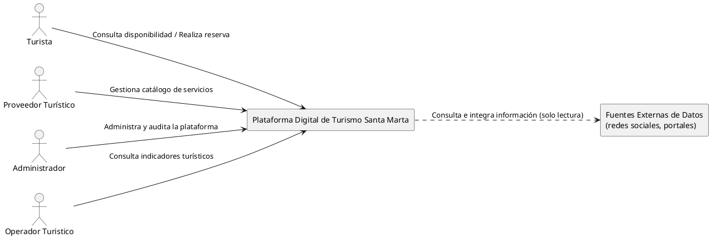
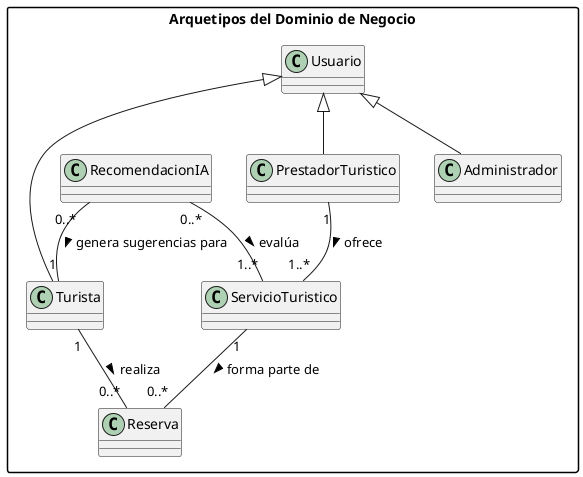
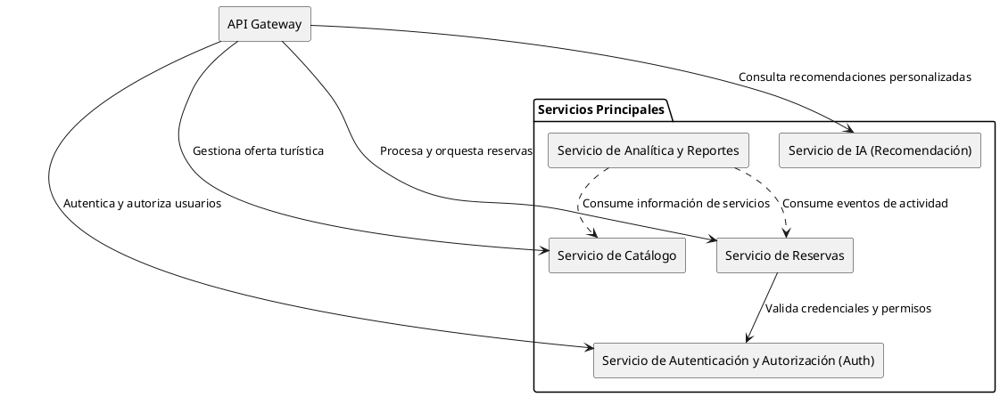

## Laboratorio 1 — Aplicando la Teoría al Proyecto Capstone

   

> **Proyecto:** Plataforma Digital para la Gestión Integrada y Sostenible del Turismo en Santa Marta.
> **Objetivo del laboratorio:** clasificar el sistema (Módulo 1), decidir su estilo y tácticas de calidad (Módulo 3), y representarlo mediante los diagramas correctos (Módulo 2), demostrando trazabilidad de principio a fin conforme a **ISO/IEC/IEEE 29148:2018**.

---

### 1. Género Arquitectónico y Decisiones Clave (Módulo 1)

#### 1.1 Géneros arquitectónicos identificados (taxonomía de Booch)

La plataforma no corresponde a un único género: combina tres categorías del *Handbook of Software Architecture* de Booch, cada una con exigencias arquitectónicas propias.

| Género (Booch) | Justificación en el contexto de Santa Marta |
| :--- | :--- |
| **Gobierno** | El proyecto se asume como una iniciativa implementada por una entidad pública de Santa Marta (p. ej. la Secretaría de Turismo o una entidad mixta de gestión del destino), con el fin de dinamizar el tercer sector de la ciudad y de la región Caribe, agregando una oferta turística hoy dispersa. Este género impone exigencias de transparencia, interoperabilidad con marcos estatales (MinTIC/MAE) y rendición de cuentas que van más allá de una simple plataforma comercial. |
| **Comerciales y no lucrativos** | El núcleo funcional del sistema —catálogo, disponibilidad, reservas, indicadores de demanda— es el motor operativo típico de una organización que gestiona un servicio, independientemente de que el patrocinador sea público. |
| **Comunicaciones** | La plataforma requiere el intercambio y gestión de información entre turistas, prestadores turísticos, administradores y diferentes servicios externos, por lo que debe facilitar la transferencia de datos y la interacción entre estos actores y sistemas. |
| **Inteligencia artificial** | El componente de recomendación/chatbot toma decisiones autónomas condicionadas por contexto (preferencias del turista, capacidad de carga), con el requisito ético explícito de explicabilidad ya definido en `Restricciones.md`. |

> [!NOTE]
> El género **Financieros**, considerado en el análisis general del proyecto (`architectural-proposals.md`), se atenúa deliberadamente en este laboratorio: el enunciado del Laboratorio 1 excluye el procesamiento de pagos del alcance evaluado aquí. Cualquier necesidad transaccional se redirige a los módulos de Reservas y Notificaciones (ver decisión clave #3).

#### 1.2 Decisiones arquitectónicas clave difíciles de cambiar

| # | Decisión | Por qué es difícil de revertir |
| :--- | :--- | :--- |
| 1 | **Adoptar microservicios como estilo base y descartar por completo el monolito**, con un microservicio propio por cada uno de los cinco integrantes del equipo. | Una vez que cada integrante desarrolla y es evaluado individualmente sobre su propio servicio, revertir a un monolito exigiría fusionar bases de código independientes y renegociar la asignación de roles de evaluación a mitad de proyecto. |
| 2 | **Punto único de entrada obligatorio vía API Gateway.** El turista, el operador y el administrador nunca se conectan directamente a un microservicio. | Cambiarlo después implicaría exponer públicamente cada servicio, rediseñar la autenticación distribuida (hoy centralizada en el Gateway) y renegociar contratos de red con cada consumidor externo ya integrado. |
| 3 | **Excluir el procesamiento de pagos propio del núcleo del prototipo**, delegándolo íntegramente a una pasarela certificada externa (Wompi/ePayco) y redirigiendo cualquier lógica asociada hacia Reservas y Notificaciones. | Revertirlo significaría asumir cumplimiento PCI-DSS propio dentro del prototipo académico, un cambio de alcance normativo y de responsabilidad que no es viable en el tiempo y presupuesto definidos en `Restricciones.md`. |

---

### 2. Estilo Arquitectónico Seleccionado (Módulo 3)

#### 2.1 Estilo elegido y su fundamento teórico

Se selecciona **Microservicios con API Gateway**, entendido como la evolución industrial directa del estilo **Llamar y Regresar** — específicamente su subestilo de **llamada de procedimiento remoto (RPC)** — combinado con el **patrón arquitectónico de distribución (Negociador/Broker)**:

| Elemento de la propuesta | Concepto del curso al que corresponde |
| :--- | :--- |
| Llamadas síncronas entre microservicios (REST/gRPC) | Llamar y regresar → subestilo RPC |
| API Gateway como punto único de entrada (decisión clave #2) | Patrón arquitectónico de distribución (Negociador/Broker) |
| Cada microservicio con su propia base de datos | Ruptura deliberada con el estilo centrado en datos (repositorio único) |
| Saga orquestada para el flujo de reservas | Patrón de concurrencia + control centralizado de la transacción distribuida |
| Cada microservicio organizado internamente en capas | Estilo en capas, aplicado *dentro* de cada componente distribuido |

Este estilo responde directamente al género **Gobierno**: una entidad pública que agrega operadores dispersos necesita límites de responsabilidad claros y auditables por servicio, y al género **Inteligencia artificial**: aislar el motor de recomendación como microservicio permite auditar y explicar sus decisiones sin mezclar esa lógica con el resto del dominio.

#### 2.2 Tabla comparativa de alternativas (obligatoria)

Ponderación 1 (bajo) a 5 (alto). Costo, Riesgo de tiempo y Complejidad se invierten (6 − valor) porque un puntaje alto en el criterio original es una condición desfavorable.

| Criterio (peso) | Monolito Modular | A1. Microservicios enterprise (K8s + Istio) | A3. Microservicios serverless | **A2. Microservicios ligeros + Gateway simple (ELEGIDA)** |
| :--- | :---: | :---: | :---: | :---: |
| Costo relativo | Bajo (1) | Alto (5) | Bajo-medio (2) | Medio (3) |
| Riesgo de tiempo (3 meses disponibles) | Bajo (1) | Alto (5) | Alto (4) | Medio (3) |
| Escalabilidad | Baja-media (2) | Alta (5) | Alta (5) | Alta (4) |
| Seguridad (aislamiento) | Media (3) | Alta (4) | Alta (4) | Alta (4) |
| Complejidad técnica para el equipo | Baja (1) | Alta (5) | Alta (5) | Media (3) |
| **Puntaje ponderado** (Costo, Riesgo y Complejidad invertidos; máx. 25) | **20** | **12** | **16** | **17** |

#### 2.3 Decisión justificada y análisis de trade-offs

**Qué se elige:** la Variante A2 (microservicios ligeros en contenedores, Gateway simple tipo Traefik/Kong, saga orquestada), descartando el monolito, la Variante A1 y la Variante A3.

**Por qué el puntaje técnico no es el criterio decisivo.** El Monolito obtiene el puntaje más alto de la tabla (20), y sin embargo se descarta por completo. La tabla anterior mide atributos de calidad del *sistema*, pero el criterio que realmente decide aquí es una restricción del *proceso de equipo*, explícita en `Diseño-de-Ingenieria.md` ("Composición del Grupo — Asignación obligatoria de roles"): con cinco estudiantes evaluados individualmente, un monolito obliga a los cinco a trabajar sobre la misma base de código, generando conflictos de integración y dificultando atribuir el trabajo de cada rol. Los microservicios permiten que cada integrante posea, desarrolle y sustente un componente propio de principio a fin.

**Por qué A2 y no A1 o A3.** A1 (Kubernetes + service mesh) queda descartada por costo y complejidad: exigiría personal de plataforma dedicado y una curva de aprendizaje incompatible con 3 meses y USD 20.000 de presupuesto piloto. A3 (serverless) queda descartada porque los *cold starts* afectan al motor de IA y porque las sagas de reserva de larga duración (consulta → pago externo → confirmación) son difíciles de orquestar en funciones efímeras sin un motor de *workflows* adicional, lo que añade curva de aprendizaje en vez de reducirla.

**Cómo influyeron las restricciones:**
- *Económicas:* con software libre y contenedores ligeros (no Kubernetes completo), A2 cabe cómodamente en el presupuesto piloto.
- *Técnicas:* la disponibilidad ≥99% exigida se resuelve con réplicas del microservicio de Reservas detrás del Gateway, sin necesitar la infraestructura de observabilidad distribuida que A1 exigiría desde el primer sprint.
- *Sociales (del equipo):* el requisito de desarrollo y evaluación individual por rol fue, como se explicó, el factor más determinante — por encima incluso del puntaje técnico.
- *Qué se gana:* propiedad clara por integrante, aislamiento de fallos entre servicios, y un componente de IA que puede auditarse y explicarse de forma independiente.
- *Qué se sacrifica:* mayor superficie de configuración de seguridad (cada servicio valida credenciales, mitigado con una librería de autenticación compartida) y más piezas de infraestructura que monitorear que en un monolito.

---

### 3. Atributos de Calidad y Tácticas (Módulo 3)

| Atributo de calidad | Táctica(s) aplicada(s) | Dónde se aplica (ver diagrama de componentes, sección 4.3) |
| :--- | :--- | :--- |
| **Disponibilidad** — continuidad del flujo de reservas en temporada alta (≥99%, `Restricciones.md`) | Redundancia activa + monitoreo por latido (*heartbeat*) + conmutación por error (*failover*) | Réplica activa del microservicio **Disponibilidad y Reservas** en una segunda zona de disponibilidad, detrás del API Gateway |
| **Desempeño** — tiempo de respuesta del motor de recomendación bajo picos estacionales | Caché de resultados frecuentes + procesamiento asíncrono para el reentrenamiento | Caché de resultados dentro del microservicio **IA (Recomendación)**, consultada antes de invocar el modelo |

---

### 4. Diagramas Actualizados (Módulo 2)

#### 4.1 Diagrama de Contexto Arquitectónico (DCA)

Refleja el estilo elegido: un único punto de entrada (decisión clave #2), el procesamiento de pagos explícitamente fuera del núcleo evaluado (decisión clave #3) y la delimitación de fronteras del sistema a alto nivel, excluyendo detalles de infraestructura y servicios externos.

#### 4.2 Diagrama de Arquetipos

Representa las **entidades principales** del dominio de negocio a alto nivel **y sus relaciones fundamentales**, abstrayendo detalles técnicos, atributos e interfaces según las indicaciones arquitectónicas recibidas.

#### 4.3 Diagrama de Componentes

Señala la arquitectura de componentes a alto nivel en su primera iteración, mostrando únicamente los servicios del sistema y su orquestación a través del punto de entrada.

---

### 5. Trazabilidad (ISO/IEC/IEEE 29148:2018)

| Decisión | Requisito/Restricción relacionado | Stakeholder(s) impactado(s) | Registro (ADR sugerido) |
| :--- | :--- | :--- | :--- |
| Microservicios, descarta monolito | `Diseño-de-Ingenieria.md` — Composición del grupo (5 roles) | SH-05 Equipo de Desarrollo, SH-06 Docente Evaluador | ADR-Lab1-01: Selección de estilo arquitectónico |
| API Gateway como punto único de entrada | `Restricciones.md` — disponibilidad ≥99%, gestión segura de autenticación | SH-01 Turista, SH-04 Administrador, SH-10 Proveedor Cloud | ADR-Lab1-02: Estrategia de comunicación e integración |
| Exclusión de pagos del núcleo | Nota de alcance del Laboratorio 1; `Restricciones.md` — cumplimiento normativo | SH-12 Servicio Externo de Pagos, SH-09 Autoridad de Protección de Datos | ADR-Lab1-03: Delimitación de alcance transaccional |
| Réplica + failover en Reservas | `Restricciones.md` — disponibilidad ≥99% | SH-01 Turista, SH-03 Hotel/Operador Establecido | ADR-Lab1-04: Táctica de disponibilidad |
| Caché en el motor de IA | `Objetivos.md` — validar rendimiento y escalabilidad | SH-13 Servicio de IA de Recomendación, SH-01 Turista | ADR-Lab1-05: Táctica de desempeño |

> [!IMPORTANT]
> **Nota de alineación con la documentación previa del proyecto.** La documentación general del capstone (`architectures-technical-details.md`, resumen en memoria del proyecto) había seleccionado como arquitectura principal un **Monolito Modular con extracción quirúrgica de IA y Notificaciones**. Este laboratorio, centrado en el ejercicio de clasificación por género y estilo de los Módulos 1–3, deriva una decisión distinta —microservicios completos vía API Gateway— priorizando explícitamente la independencia de desarrollo individual del equipo. Ambas decisiones quedan documentadas; se recomienda que el equipo resuelva y justifique explícitamente esta divergencia en el **Documento de Diseño Arquitectónico Final**, ya sea ratificando los microservicios o retomando el monolito híbrido, antes de avanzar a la implementación del prototipo.
