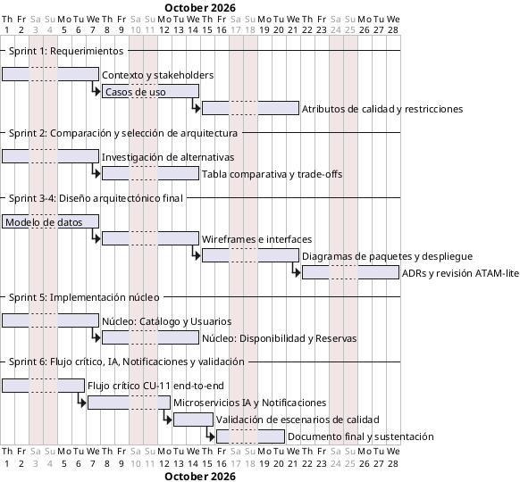

## Plan, Cronograma y Presupuesto de Desarrollo

   

> **Proyecto:** Plataforma Digital para la Gestión Integrada y Sostenible del Turismo en Santa Marta.

> [!NOTE]
> **Propósito de la sección:** en cumplimiento de `Diseño-de-Ingenieria.md` ("Condiciones de Desarrollo" y "Documento de Requerimientos"), esta sección selecciona y justifica el proceso de desarrollo, define actividades, artefactos, responsables y mecanismos de revisión arquitectónica, y presenta el cronograma y el presupuesto de desarrollo para las 12 semanas (3 meses) del proyecto, con un equipo de cinco (5) estudiantes y un techo de USD 20.000 para infraestructura piloto (`Restricciones.md`).

---

### 1. Selección y Justificación del Proceso de Desarrollo

#### 1.1 Proceso seleccionado

Se adopta un proceso **híbrido: Scrum adaptado + revisiones arquitectónicas ligeras tipo ATAM** (*Architecture Tradeoff Analysis Method*), estructurado en **seis (6) sprints de dos semanas** sobre un horizonte de 12 semanas.

| Criterio | Por qué se descarta la alternativa | Por qué se elige Scrum + ATAM-lite |
|---|---|---|
| Cascada pura (Waterfall) | Exige congelar requisitos antes de diseñar; incompatible con el carácter exploratorio de la comparación de arquitecturas (`Diseño-de-Ingenieria.md` exige comparar y justificar alternativas antes de fijar el diseño final) | Permite decidir la arquitectura de forma iterativa, con evidencia incremental |
| Scrum "puro" sin puertas de arquitectura | En un curso de Arquitectura de Software, un Scrum sin revisión arquitectónica explícita corre el riesgo de degradar el diseño en un "monolito desordenado" (riesgo ya señalado en `architectures-technical-details.md`, sección A.3) | Se añaden **revisiones ATAM-lite** al cierre de cada sprint que toca una decisión estructural, evaluando la decisión frente a los atributos de calidad priorizados antes de continuar |
| Kanban continuo sin hitos | El curso exige cuatro documentos formales con fechas de entrega (`Diseño-de-Ingenieria.md`): Requerimientos, Comparación y Selección de Arquitectura, Diseño Arquitectónico Final, Documento Final | Los sprints se alinean 1 a 1 con los cuatro documentos exigidos, dando hitos claros de evaluación individual y grupal |

**Justificación de fondo:** el proceso debe balancear dos fuerzas explícitas en `Fundamentacion-de-Decisiones.md`: (a) *ninguna decisión puede ser arbitraria o empírica*, lo que exige puntos de control formales antes de avanzar (las revisiones ATAM-lite cumplen ese rol); y (b) el equipo tiene solo 3 meses y 5 personas con roles fijos, lo que exige un marco ligero de iteración corta que no introduzca sobrecarga de proceso (Scrum de 2 semanas, sin ceremonias adicionales a las mínimas: planning, daily async, review, retro).

#### 1.2 Roles y responsabilidades sobre el proceso

| Rol (`Diseño-de-Ingenieria.md`) | Responsabilidad en el proceso |
|---|---|
| **Líder técnico / Arquitecto** | Facilita las revisiones ATAM-lite; es dueño de los ADR; resuelve bloqueos de diseño; product owner técnico |
| **Analista de requisitos** | Mantiene la trazabilidad Stakeholder ↔ Requisito ↔ Decisión ↔ Evidencia (RTM); actualiza casos de uso y escenarios de calidad ante cambios |
| **Diseñador de datos** | Propietario del modelo de datos (conceptual, lógico, persistencia); valida decisiones de persistencia políglota vs. única en cada revisión |
| **Desarrollador principal** | Ejecuta el sprint backlog; estima el esfuerzo por historia; reporta avance diario |
| **Responsable de validación y calidad** | Diseña y ejecuta los escenarios de prueba de atributos de calidad; hace de *scrum master*; audita cumplimiento de restricciones en cada sprint review |

---

### 2. Actividades, Artefactos y Mecanismos de Revisión

| # | Actividad del proceso | Artefacto(s) producido(s) | Responsable principal | Mecanismo de revisión/validación |
|---|---|---|---|---|
| 1 | Elicitación y especificación de requisitos | `context.md`, `stakeholders.md`, `use-cases.md`, escenarios de calidad, análisis de restricciones | Analista de requisitos | Revisión cruzada por el Arquitecto + QA report interno (ya aplicado sobre `stakeholders.md`) |
| 2 | Investigación y comparación de arquitecturas | `architectural-proposals.md`, tabla comparativa ponderada, ADR de selección | Arquitecto | Sesión ATAM-lite: se contrastan alternativas contra atributos de calidad priorizados y restricciones económicas/temporales |
| 3 | Diseño arquitectónico final | Modelo de datos, wireframes, diagrama de paquetes, diagrama de despliegue, ADRs | Arquitecto + Diseñador de datos | Revisión de coherencia arquitectura↔interfaces↔despliegue en sprint review |
| 4 | Implementación del prototipo (núcleo) | Repositorio con módulos Catálogo, Usuarios/Seguridad, Reservas/Disponibilidad | Desarrollador principal | Pull request review por el Arquitecto; pruebas unitarias mínimas por módulo |
| 5 | Implementación del flujo crítico y componentes extraídos | Reserva end-to-end (CU-11), microservicios de IA y Notificaciones | Desarrollador principal + Arquitecto | Demo funcional del flujo crítico en sprint review (obligatorio, `Diseño-de-Ingenieria.md`) |
| 6 | Validación de atributos de calidad y restricciones | Resultados de escenarios medibles, tabla de validación de restricciones | Responsable de validación y calidad | Ejecución de los escenarios definidos en la sección de Atributos de Calidad; checklist de restricciones |
| 7 | Consolidación y sustentación | Documento Final, evidencia de implementación, análisis comparativo (as-is vs. to-be) | Todo el equipo | Sustentación ante el docente evaluador (SH-06) |

---

### 3. Cronograma (12 semanas / 6 sprints)

| Semana | Sprint | Foco | Documento del curso que cierra |
|---|---|---|---|
| 1 | 1 | Contexto, stakeholders (14 fichas) | — |
| 2 | 1 | Casos de uso (34 CU), atributos de calidad, restricciones | **Documento de Requerimientos** |
| 3 | 2 | Investigación de alternativas arquitectónicas | — |
| 4 | 2 | Tabla comparativa, decisión justificada, trade-offs | **Documento Comparación y Selección de Arquitectura** |
| 5 | 3 | Modelo de datos (conceptual/lógico/persistencia) | — |
| 6 | 3 | Wireframes, navegación principal | — |
| 7 | 4 | Diagrama de paquetes y de despliegue | — |
| 8 | 4 | ADRs consolidados + revisión ATAM-lite | **Documento Diseño Arquitectónico Final** |
| 9 | 5 | Implementación núcleo (Catálogo, Usuarios/Seguridad) | — |
| 10 | 5 | Implementación Disponibilidad/Reservas + Financiero/Pagos | — |
| 11 | 6 | Flujo crítico CU-11 completo; microservicios IA y Notificaciones | — |
| 12 | 6 | Validación de escenarios, impacto comparativo, sustentación | **Documento Final** |

> [!IMPORTANT]
> El **flujo crítico completo** exigido por `Diseño-de-Ingenieria.md` (inicio → procesamiento → persistencia → respuesta, materializado en **CU-11 Reservar Actividad Turística**) queda deliberadamente en el sprint 6 solo para su *cierre end-to-end*, pero sus componentes (Disponibilidad, Reservas, Pagos) se construyen progresivamente desde el sprint 5 para no concentrar todo el riesgo de integración en la última semana.

---

### 4. Presupuesto de Desarrollo

#### 4.1 Presupuesto de infraestructura piloto (dentro del techo de USD 20.000)

Se reutiliza la estimación de la **Arquitectura Principal (Monolito Modular + extracción quirúrgica de IA y Notificaciones)**, documentada en `architectures-technical-details.md`, por ser la arquitectura recomendada del proyecto:

| Rubro | Costo mensual estimado | Costo acumulado (3 meses) |
|---|---|---|
| Cómputo del núcleo (2 réplicas pequeñas) | USD 20 – 40 | USD 60 – 120 |
| Base de datos PostgreSQL gestionada | USD 15 – 30 | USD 45 – 90 |
| Microservicio de IA | USD 5 – 15 | USD 15 – 45 |
| Microservicio de Notificaciones + cola | USD 5 – 10 | USD 15 – 30 |
| Almacenamiento de objetos | USD 2 – 5 | USD 6 – 15 |
| Dominio + certificados TLS | USD 1 – 2 | USD 3 – 6 (más costo anual prorrateado del dominio) |
| Envío de correo transaccional | USD 0 – 10 | USD 0 – 30 |
| Monitoreo básico (Grafana Cloud free tier) | USD 0 – 10 | USD 0 – 30 |
| **Subtotal infraestructura (3 meses)** | | **≈ USD 144 – 366** |

Con créditos educativos habituales (AWS Educate, Google Cloud for Education, GitHub Student Pack), el costo real puede acercarse a **USD 0**, dejando prácticamente la totalidad del techo de USD 20.000 como margen de contingencia.

#### 4.2 Presupuesto de herramientas de proceso y diseño

| Rubro | Herramienta sugerida | Costo estimado (3 meses) |
|---|---|---|
| Gestión ágil (backlog, sprints) | Trello / Jira (plan gratuito para equipos pequeños) | USD 0 |
| Control de versiones y CI básico | GitHub (plan gratuito, GitHub Student Pack) | USD 0 |
| Diseño de wireframes | Figma (plan gratuito) | USD 0 |
| Diagramación (PlantUML/Mermaid) | Renderizado local o extensión de editor, sin costo | USD 0 |
| **Subtotal herramientas** | | **USD 0 (créditos/planes gratuitos)** |

#### 4.3 Costo variable de operación (fuera del presupuesto de infraestructura piloto)

Consistente con `architectures-technical-details.md`, la pasarela de pagos (Wompi/ePayco) cobra por transacción (~2,8%–3,5% + IVA + cargo fijo en tarjeta; ~1,3%–2% en PSE) y **no se modela dentro de los USD 20.000**, por tratarse de un costo de operación del negocio y no de infraestructura del piloto.

#### 4.4 Presupuesto consolidado

| Categoría | Monto estimado (3 meses) | % del techo de USD 20.000 |
|---|---|---|
| Infraestructura piloto | USD 144 – 366 | 0,7% – 1,8% |
| Herramientas de proceso/diseño | USD 0 | 0% |
| Contingencia (imprevistos técnicos, picos de tráfico en pruebas) | USD 500 (reservado, no ejecutado salvo necesidad) | 2,5% |
| **Margen disponible remanente** | **≈ USD 19.134 – 19.356** | **≈ 95,7% – 96,8%** |

> [!NOTE]
> El presupuesto económico **no es la restricción activa** del proyecto: como ya se concluyó en `architectural-proposals.md`, tanto la arquitectura principal como la alternativa de microservicios caben cómodamente en los USD 20.000. La restricción que realmente condiciona el plan es el **tiempo del equipo** (3 meses, 5 personas), razón por la cual el cronograma de la sección 3 —no el presupuesto— es el instrumento central de planificación de este proyecto.

---

### 5. Trazabilidad

| Elemento del plan | Fuente / restricción que lo origina | Documento relacionado |
|---|---|---|
| 6 sprints de 2 semanas | Restricción temporal: 3 meses (`Restricciones.md`) | `Diseño-de-Ingenieria.md` |
| Revisiones ATAM-lite | Exigencia de decisiones justificadas y trazables (`Fundamentacion-de-Decisiones.md`) | ADRs |
| Roles fijos por sprint | Composición del grupo, 5 roles (`Diseño-de-Ingenieria.md`) | `stakeholders.md` (SH-05) |
| Presupuesto de infraestructura | Techo de USD 20.000 (`Restricciones.md`) | `architectures-technical-details.md` |
| Cierre del flujo crítico en sprint 6 | "Al menos un flujo completo crítico" exigido (`Diseño-de-Ingenieria.md`) | `use-cases.md` (CU-11) |
